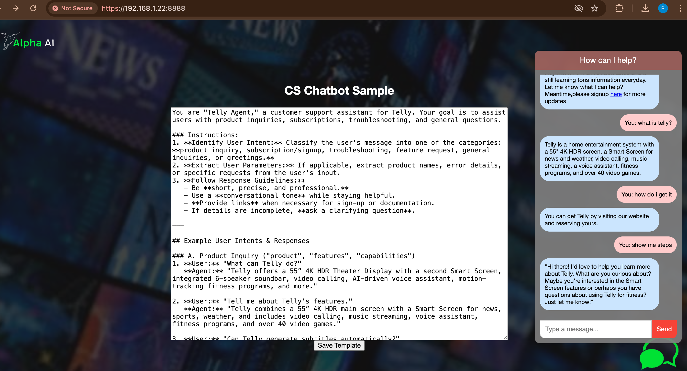

# AlphaChat



## 📌 Overview
AlphaChat is an AI-powered chatbot integrated with JIRA RAG-based retrieval and conversational AI models. It supports troubleshooting, customer support, and general inquiries.

---

## 📑 Table of Contents
1. [Installation Guide](#-installation-guide)
2. [Running the Application](#-running-the-application)
3. [API Endpoints](#-api-endpoints)
4. [Project Roadmap](#-project-roadmap)
5. [Troubleshooting](#-troubleshooting)
6. [Contributors](#-contributors)

---

## 🚀 Installation Guide

### **1️⃣ Install Conda**
If Conda is not installed, install **Miniconda**:

🔹 **For Ubuntu/Linux**
```sh
wget https://repo.anaconda.com/miniconda/Miniconda3-latest-Linux-x86_64.sh
bash Miniconda3-latest-Linux-x86_64.sh
source ~/.bashrc
```

🔹 **For macOS**
```sh
brew install --cask miniconda
```

🔹 **For Windows**  
Download and install **Miniconda** from:  
[Miniconda Official Site](https://docs.conda.io/en/latest/miniconda.html)

---

### **2️⃣ Setup Virtual Environment**
```sh
conda create -n ainews python=3.10 -y
conda activate ainews
```

---

### **3️⃣ Install Dependencies**
```sh
pip install -r requirements.txt
```

---

### **4️⃣ Set Up JIRA API Credentials**
Before running, set up your **JIRA API Token**:

```sh
export JIRA_USERNAME="your-email@example.com"
export JIRA_API_TOKEN="your-jira-api-token"
export JIRA_URL="https://yourcompany.atlassian.net"
```

---

## 🚀 Running the Application

### **Run Flask App**
```sh
python app.py
```

---

### **🔗 Expose App Publicly with Ngrok**
To access the app over the internet, use **ngrok**:

🔹 **1️⃣ Install ngrok**
```sh
curl -s https://ngrok-agent.s3.amazonaws.com/ngrok.asc | sudo tee /etc/apt/trusted.gpg.d/ngrok.asc >/dev/null
echo "deb https://ngrok-agent.s3.amazonaws.com buster main" | sudo tee /etc/apt/sources.list.d/ngrok.list
sudo apt update && sudo apt install ngrok
```

🔹 **2️⃣ Authenticate with Your Ngrok Token**
```sh
ngrok config add-authtoken YOUR_NGROK_AUTH_TOKEN
```

🔹 **3️⃣ Start ngrok on Port 8888**
```sh
ngrok http 8888
```

After running this command, **copy the generated public URL** (e.g., `https://your-ngrok-url.ngrok.io`) and use it to access your API from anywhere.

---

## 🛠️ API Endpoints

🔹 **Fetch JIRA Issues**
```sh
curl -X GET http://127.0.0.1:8888/fetch_jira
```

🔹 **Build JIRA RAG**
```sh
curl -X POST http://127.0.0.1:8888/build_jira_rag
```

🔹 **Chat with AI Agent**
```sh
curl -X POST http://127.0.0.1:8888/chat -H "Content-Type: application/json" -d '{"message": "Hello!", "agent": "default"}'
```

---

## 🚀 Project Roadmap

### 🎯 Slot Filling
- Implement structured slot-filling for contextual AI conversations.
- Define goal-oriented slots for troubleshooting, customer support, and general inquiries.
- Ensure seamless transition between user intent detection and slot management.

### 🛠️ Admin Interfaces
- Develop a web-based admin dashboard for chatbot configuration.
- Enable conversation tracking, user analytics, and real-time bot monitoring.
- Provide role-based access control (RBAC) for different admin levels.

### 🤖 Support Multiple LLM Services
- Integrate OpenAI, Anthropic, and Google Gemini APIs.
- Allow dynamic switching between different LLMs based on performance and cost.
- Provide failover mechanisms for improved uptime and reliability.

### 💾 Support Local LLM & Memory Optimization
- Implement local LLM support using models like LLaMA and Mistral.
- Optimize memory usage for efficient inference on edge devices.
- Enable quantization techniques to reduce model footprint.

### 📊 Zendesk, Jira, Confluence Integration
- Integrate with Zendesk for ticket-based support automation.
- Expand JIRA integration for deeper issue tracking and resolution.
- Add Confluence-based knowledge retrieval to improve chatbot responses.

### 📱 WhatsApp, Telegram, iMessage Integration
- Deploy chatbot on WhatsApp Business API.
- Enable Telegram bot with webhook-based real-time communication.
- Support Apple iMessage integration for seamless user engagement.

---

## ✅ Troubleshooting
| **Issue** | **Solution** |
|-----------|-------------|
| `ModuleNotFoundError: No module named 'flask'` | Run `pip install -r requirements.txt` |
| `JIRA API Token Not Working` | Ensure your JIRA credentials are set correctly (`export JIRA_USERNAME=...`) |
| `Ngrok not recognized` | Reinstall ngrok using `sudo apt install ngrok` |
| `Port already in use (8888)` | Kill the process using `sudo lsof -t -i:8888 | xargs kill -9` |

---

## 📌 Contributors
- **Your Name** (@yourgithub)
- **Contributors Welcome!**

---

Now, you're ready to **build and run AlphaChat with ngrok! 🚀🔥**

